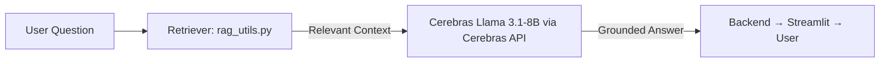

# ChatClass AI  
**An AI-powered oral quiz assistant for classroom and self-learning.**

ChatClass AI transforms ordinary quizzes into engaging, spoken learning experiences.  
It uses **Cerebras’ hosted Meta Llama 3.1-8B model** for intelligent answer generation, **RAG (Retrieval-Augmented Generation)** for factual grounding, and **gTTS** to give the AI a natural voice — all powered by **FastAPI**, **Streamlit**, and **Docker**.

---

## Features

**AI-generated oral questions & answers** — Powered by **Meta’s Llama 3.1-8B model** served via **Cerebras’ inference API**.  
 **Voice output with gTTS** — Converts every question or answer into natural-sounding speech.  
 **Retrieval-Augmented Generation (RAG)** — Retrieves relevant data for grounded, accurate answers.  
 **FastAPI backend** — Manages AI queries, RAG retrieval, and text-to-speech generation.  
 **Streamlit frontend** — User-friendly interface for real-time interactive learning.  
 **Dockerized setup** — Ensures reproducibility, portability, and multi-service orchestration.  

---

##  Architecture Overview

```mermaid
flowchart LR
    A[ User (Browser)] -->|Interact| B[Streamlit Frontend]
    B -->|HTTP request| C[FastAPI Backend]
    C -->|RAG Context + Query| D[(Cerebras Llama 3.1-8B API)]
    C -->|Generate Audio| E[gTTS (Text-to-Speech)]
```

**Flow:**
1. The user opens the Streamlit app and selects a quiz.  
2. The question is sent to the FastAPI backend.  
3. The backend retrieves relevant context using **RAG (rag_utils.py)**.  
4. That context and question are sent to **Cerebras**, which runs **Meta’s Llama 3.1-8B model**.  
5. The AI’s answer is converted into audio using **gTTS**, creating a spoken response.

---

##  RAG (Retrieval-Augmented Generation) Integration

To improve factual accuracy, ChatClass AI includes a **RAG layer** in the backend (`rag_utils.py`).



**How it works:**
1. When a user asks a question, the retriever searches stored data or embeddings.  
2. The retrieved context is appended to the prompt sent to **Cerebras’ Llama 3.1-8B model**.  
3. The model then answers using both the question and retrieved facts.

**Why it matters:**
- Reduces hallucinations and improves reliability.  
- Ensures AI responses are based on actual provided knowledge.  
- Makes ChatClass AI adaptable to any subject — from classroom lessons to FAQs.

---

## Tech Stack

| Layer | Technology | Purpose |
|-------|-------------|----------|
|  AI | **Cerebras-hosted Meta Llama 3.1-8B** | Generates intelligent, context-aware answers with low latency |
|  RAG | **Custom retriever (rag_utils.py)** | Adds factual grounding using retrieved data |
|  Speech | **gTTS** | Converts generated text into spoken audio |
|  Backend | **FastAPI** | Handles API routing, LLM integration, and speech generation |
|  Frontend | **Streamlit** | Simple, responsive, and classroom-friendly interface |
|  Containerization | **Docker** | Runs backend and frontend in isolated containers for reproducibility |

---

##  Local Setup (With Docker)

### 1️ Clone the repository
```bash
git clone https://github.com/yourusername/ChatClassAI.git
cd ChatClassAI
```

### 2️ Add environment variables  
Create a `.env` file in the project root:
```bash
LLM_API_KEY=your_cerebras_api_key
LLM_ENDPOINT=https://api.cerebras.ai/v1/chat/completions
```

### 3️ Build and run containers
```bash
docker compose up --build
```

### 4️ Access the app
- **Frontend (Streamlit):** [http://localhost:8501](http://localhost:8501)  
- **Backend (FastAPI docs):** [http://localhost:8000/docs](http://localhost:8000/docs)

---

##  Testing the Features

| Test | Expected Result |
|------|------------------|
| Launch app | Streamlit interface opens with quiz options |
| Ask a question | Backend sends RAG-enhanced query to Cerebras |
| View response | Llama 3.1-8B generates accurate answer |
| Play answer | gTTS produces and streams audio |
| Check logs | FastAPI logs show Cerebras and RAG operations |

---

##  Integration with Sponsor Technologies

| Sponsor | Usage | Impact |
|----------|--------|--------|
| **Cerebras × Meta (Llama 3.1-8B)** | ChatClass AI uses **Meta’s open-weight Llama 3.1 model** via the **Cerebras API** for low-latency inference and accurate response generation. | Demonstrates dual-sponsor integration: Meta’s LLM research deployed through Cerebras’ scalable inference. |
| **Docker** | Containerizes frontend (Streamlit) and backend (FastAPI). | Ensures reproducibility and cross-platform consistency. |
| **Meta (Conceptual alignment)** | Focuses on democratizing AI learning and accessibility. | Showcases educational use of open-weight models. |

> Even though Docker use is lightweight, it provides a reproducible, modular system architecture that demonstrates understanding of containerized AI workflows.

---

##  Design Decisions

- **Cerebras-hosted Llama 3.1-8B:** Chosen for its fast inference and open-weight transparency.  
- **RAG system:** Enhances factual accuracy and adaptability to new topics.  
- **gTTS integration:** Converts answers into natural speech for accessibility.  
- **FastAPI + Streamlit separation:** Clean architecture and easy scaling.  
- **Dockerized microservices:** Simplifies deployment and version control.  

---

##  Future Improvements

- Integrate speech recognition for full conversational feedback.  
- Add a persistent vector database for larger RAG datasets.  
- Deploy on a public cloud (Render, Hugging Face Spaces, or AWS).  
- Integrate optional MCP Gateway for advanced logging and routing analytics.

---

##  Team & Credits

- **Harsh Yadav** — Developer, Architect & AI Integrator  
- **Hackathon Sponsors:** Cerebras | Meta | Docker  

---

##  Summary

> **ChatClass AI** bridges education and AI — transforming quizzes into interactive, voice-enabled, and fact-grounded learning experiences.  
> It uniquely combines **Cerebras’ Llama 3.1-8B**, **RAG retrieval**, **gTTS**, and **Dockerized microservices** — demonstrating sponsor technology synergy, technical depth, and creativity in implementation.  
