# ChatClass AI  
**An AI-powered multilingual oral quiz and learning assistant for classrooms and self-study.**

ChatClass AI transforms any document or topic into an **interactive, multilingual, spoken learning experience**.  
It can **summarize uploaded PDFs**, **generate contextual quiz questions**, and **speak answers aloud** in multiple languages — making it accessible to learners worldwide.  

Built with **Cerebras’ hosted Meta Llama 3.1-8B model**, **Retrieval-Augmented Generation (RAG)** for factual grounding, and **gTTS** for lifelike multilingual voice synthesis — all orchestrated through **FastAPI**, **Streamlit**, and **Docker**.

---

## Features

### Intelligent Learning
- **PDF Summarization & Auto-Quiz Generation** — Upload any PDF (lesson, article, or study material) and let the AI summarize it and create relevant oral quiz questions.  
- **AI-generated Oral Q&A** — Uses **Meta’s Llama 3.1-8B** hosted on **Cerebras** for natural, context-aware question answering.  
- **Voice Output with gTTS** — Converts every question and answer into clear, human-like speech.  
- **Retrieval-Augmented Generation (RAG)** — Ensures accuracy by grounding responses in retrieved factual context.  
- **Multi-Language Support** — Learners can choose their preferred language (English, Hindi, Spanish, French, etc.) for both text and voice output, powered by **gTTS multilingual synthesis** and **language-aware prompts** for **Llama 3.1-8B**.  

### Architecture & System Design
- **FastAPI Backend** — Manages RAG retrieval, LLM inference, and text-to-speech generation.  
- **Streamlit Frontend** — Provides a clean, interactive interface for classroom or self-learning use.  
- **Dockerized Setup** — Fully containerized backend and frontend for easy deployment and reproducibility.  
- **Cerebras × Meta Integration** — Combines Meta’s open-weight model with Cerebras’ high-performance inference infrastructure.

---

## Architecture Overview


**Flow:**
1. The user opens the Streamlit app and selects or uploads study material.  
2. The question or extracted text is sent to the FastAPI backend.  
3. The backend retrieves relevant context using **RAG (rag_utils.py)**.  
4. Context and query are sent to **Cerebras’ Llama 3.1-8B** model.  
5. The AI’s response is spoken aloud via **gTTS**, completing the oral learning loop.

---

## PDF Summarization & Auto-Quiz Generation

ChatClass AI can **ingest any uploaded PDF**, **summarize it**, and then **generate oral quiz questions** from its content — turning textbooks, notes, or research papers into interactive learning sessions.

```mermaid
flowchart LR
    U["User Uploads PDF"] --> P["FastAPI Backend"]
    P --> E["Text Extraction & Chunking"]
    E --> S["Summary Generation via Cerebras Llama 3.1-8B"]
    S --> Q["Question Generation Module"]
    Q -->|Questions + Answers| F["Streamlit Frontend → Spoken via gTTS"]
```



**How it works:**
1. The user uploads a `.pdf` file through the Streamlit interface.  
2. The backend extracts and cleans text from the PDF.  
3. The model summarizes the key concepts using **Cerebras Llama 3.1-8B**.  
4. Relevant quiz questions are generated from the summary.  
5. Questions and answers are spoken via **gTTS**, providing a fully voice-driven experience.

**Benefits:**
- Instantly converts study material into dynamic Q&A sessions.  
- Reduces manual quiz creation effort for teachers and learners.  
- Improves comprehension and retention with active recall and auditory reinforcement.

---

## Multi-Language Learning Support

ChatClass AI makes global learning seamless with its **built-in multilingual capability**.


**How it works:**
1. The user selects a preferred language from the Streamlit interface.  
2. The backend dynamically adjusts prompts and context to generate responses in that language.  
3. **gTTS** synthesizes spoken audio in the same language and accent.  

**Supported examples:** English 🇬🇧 | Hindi 🇮🇳 | Spanish 🇪🇸 | French 🇫🇷 | German 🇩🇪 | Japanese 🇯🇵 | and many more.

**Benefits:**
- Makes quizzes and summaries accessible to non-English speakers.  
- Enables use in multilingual classrooms.  
- Supports language learning through oral comprehension practice.

---

## RAG (Retrieval-Augmented Generation) Integration

```mermaid
flowchart LR
    Q["User Question"] --> R["Retriever: rag_utils.py"]
    R -->|Relevant Context| M["Cerebras Llama 3.1-8B via Cerebras API"]
    M -->|Grounded Answer| B["Backend → Streamlit → User"]
```



**Purpose:**  
- Reduces hallucinations and ensures factual reliability.  
- Makes ChatClass AI adaptable to multiple knowledge bases.  

---

## Tech Stack

| Layer | Technology | Purpose |
|-------|-------------|----------|
| AI | **Cerebras-hosted Meta Llama 3.1-8B** | Low-latency, intelligent answer generation |
| RAG | **Custom retriever (`rag_utils.py`)** | Adds factual grounding using contextual data |
| Speech | **gTTS** | Converts generated text to natural speech |
| Backend | **FastAPI** | Handles API routing, model calls, and speech synthesis |
| Frontend | **Streamlit** | Interactive UI for quizzes and uploads |
| Containerization | **Docker** | Portable, reproducible environment for deployment |

---

## Local Setup (with Docker)

### 1️Clone the repository
```bash
git clone https://github.com/yourusername/ChatClassAI.git
cd ChatClassAI
```

### 2️Add environment variables
Create a `.env` file in the project root:
```bash
LLM_API_KEY=your_cerebras_api_key
LLM_ENDPOINT=https://api.cerebras.ai/v1/chat/completions
```

### 3 Build and run
```bash
docker compose up --build
```

### 4️⃣ Access the app
- **Frontend (Streamlit):** http://localhost:8501  
- **Backend (FastAPI Docs):** http://localhost:8000/docs  

---

##  Testing the Features

| Test | Expected Result |
|------|------------------|
| Launch app | Streamlit interface opens with upload & quiz options |
| Upload PDF | File gets summarized automatically |
| Generate quiz | AI creates and speaks context-relevant questions |
| Ask manual question | RAG + Llama 3.1-8B produce accurate spoken response |
| Multi-language quiz | Responses and audio adapt to selected language |
| Check logs | FastAPI logs show RAG and Cerebras API calls |

---

##  Integration with Sponsors

| Sponsor | Usage | Impact |
|----------|--------|--------|
| **Cerebras × Meta (Llama 3.1-8B)** | Provides the AI reasoning layer for summarization and Q&A. | Demonstrates synergy between Meta’s open-weight model and Cerebras’ efficient inference. |
| **Docker** | Containerizes backend and frontend. | Enables reproducible, cross-platform development. |
| **Meta (Conceptual Alignment)** | Supports open, accessible AI education. | Showcases AI for learning and skill development. |

---

## Design Decisions

- **Cerebras-hosted Llama 3.1-8B:** Fast inference, open-weight transparency.  
- **RAG Layer:** Factual grounding for accurate, explainable answers.  
- **gTTS Integration:** Accessibility via natural voice output.  
- **FastAPI + Streamlit Separation:** Clean microservice design.  
- **Dockerized Services:** Simpler deployment and version control.  

---

## Future Improvements

- Add speech-to-text input for full conversational learning.  
- Integrate persistent vector database for richer RAG context.  
- Cloud deployment (Render, Hugging Face Spaces, AWS).  
- Optionally integrate **MCP Gateway** for advanced telemetry and routing.  
- Expand multilingual voice options with neural TTS engines.  

---

## Team & Credits

- **Harsh Yadav** — Developer, Architect & AI Integrator  
- **Hackathon Sponsors:** Cerebras | Meta | Docker  

---

## Summary

> **ChatClass AI** transforms static study material into interactive, voice-enabled, and multilingual learning sessions.  
> It uniquely combines **Cerebras Llama 3.1-8B**, **RAG**, **gTTS**, and **Dockerized microservices** to create an adaptive classroom experience — bridging content understanding with active recall and auditory learning.
